# Pixelpallete.
Pixelpallete is designed to connect artists with art enthusiasts. It serves as a marketplace for artists to showcase their masterpieces while providing a seamless experience for art lovers to explore, interact, and purchase their favorite art pieces.

## Features
* Artist Showcases: Artists can create profiles and exhibit their best artworks, providing a portfolio for potential buyers.
* Artwork Categorization and Search: Enables easy browsing and discovery through categorization and search functionalities.
* User-Friendly Interface: Offers an intuitive and visually appealing platform for a delightful user experience.

## Usage
1. Signup/Login: 
For the best experience, you will need to login or signup. You can do that by clicking on either the signup or login button: 
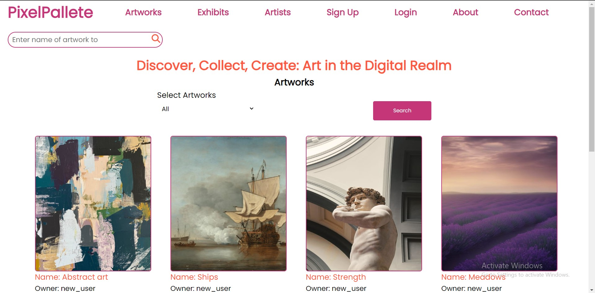 
If you are signing up, you have the option to choose to either sign up as an artist or an art enthusiast: 
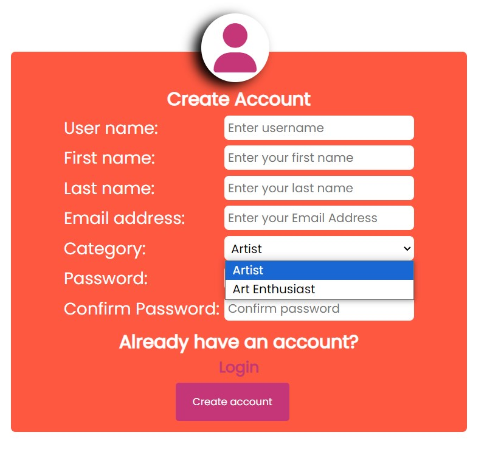 

2. Explore Artworks: 
Visit the website and start exploring the diverse range of art showcased by talented artists. 
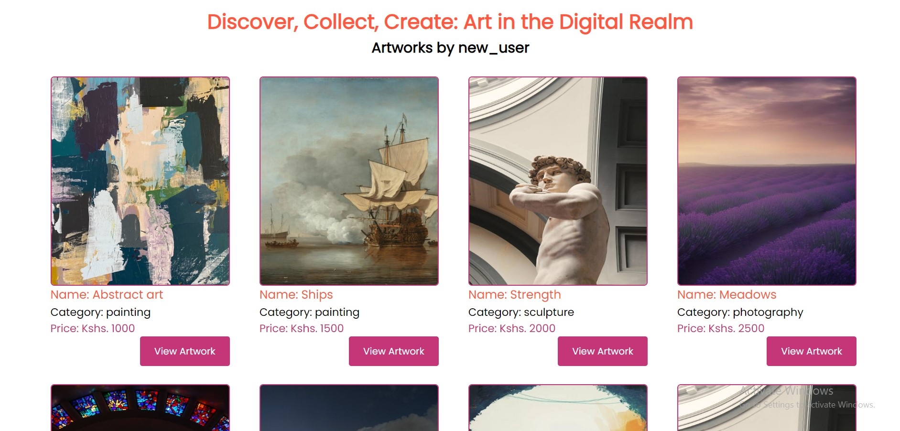 

3. Artist Interaction: 
You can filter by categories provided and click on them to view individual arts. 
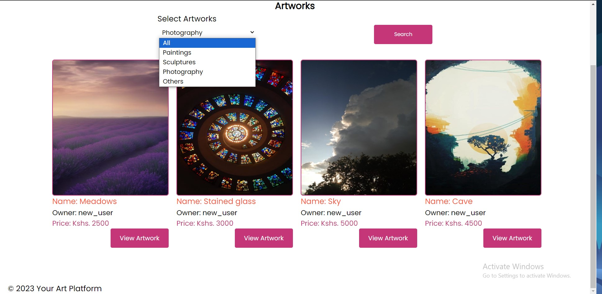 

4. Uploading art: 
As an artist you will be able to upload your media along with a description and price tag to the platform. Just click on the hamburger button on the top left of your screen and choose to `Add An Artwork` 
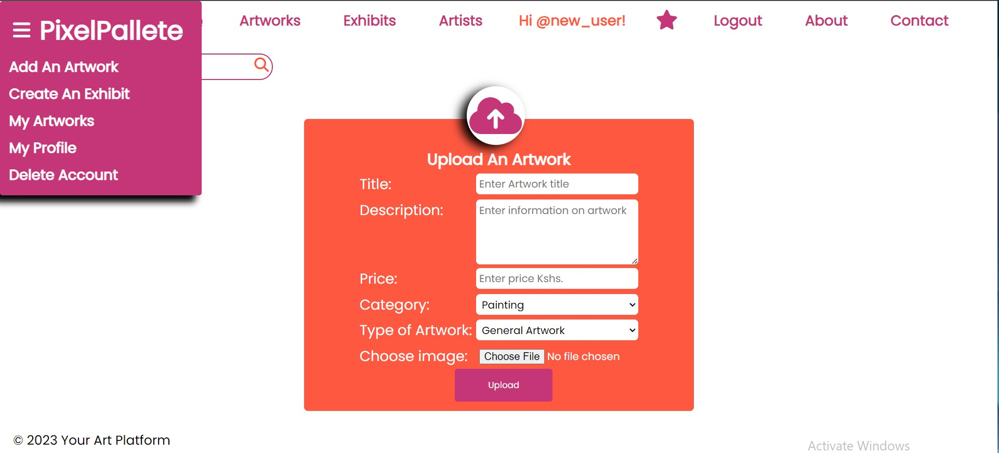

5. Adding to favorites: 
If you find an art piece you love, view the art and add it to your favorites cart(highlighted). 
 
Your items will appear in your cart. 
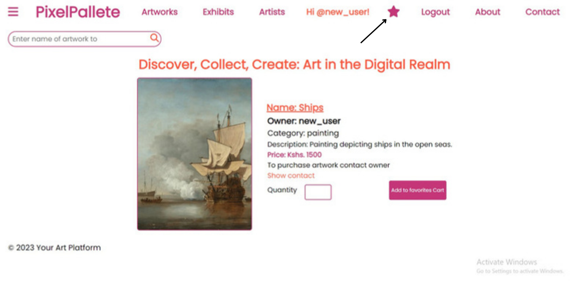 

6. Add exhibitions: 
As an artist, you might want to exhibit your work on the platform and you can do that by clicking on the hamburger button on the top left of your sccreen and selecting `Create An Exhibit`: 
You then need name your exhibition and specify for how long you want the exhibit to run. 
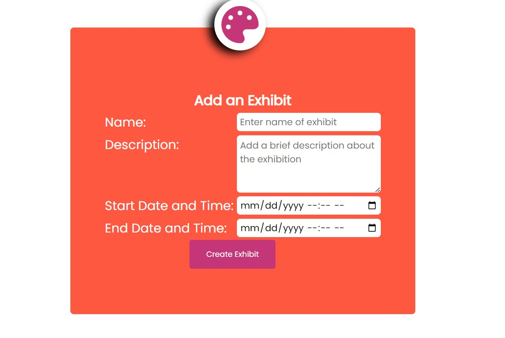 
After that you need to add you artwork to the exhibit by visiting your `My Artworks` page and choosing from your artworks the artworks you wish to add to the exhibit 
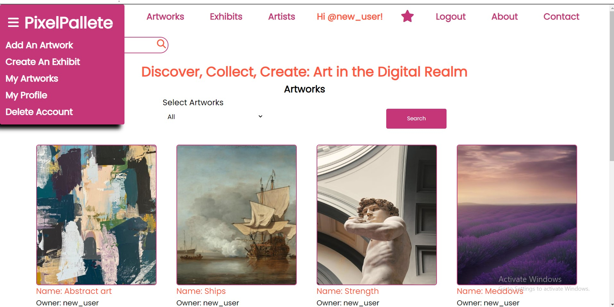 
You should see it appear in the Exhibits section of your page. 
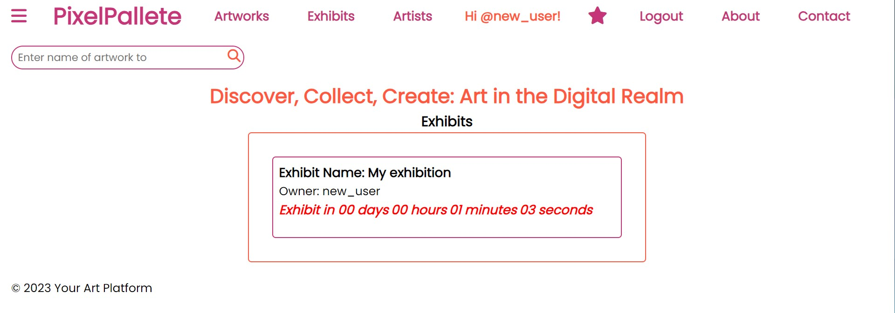 
Additionally you can choose to have an artwork exclusively as an exhibit artwork by chosing to upload to `exhibit artwork` by going to my artworks you can then add it to exhibits, such artworks will only be available in the exhibit. After the exhibit you can choose to add it to the general artwork 
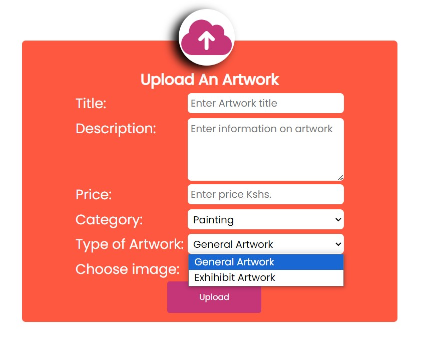 

7. Discover Artists: 
You can be able to see all artists by visiting the artists page where you can view all artworks of a specific artist. 
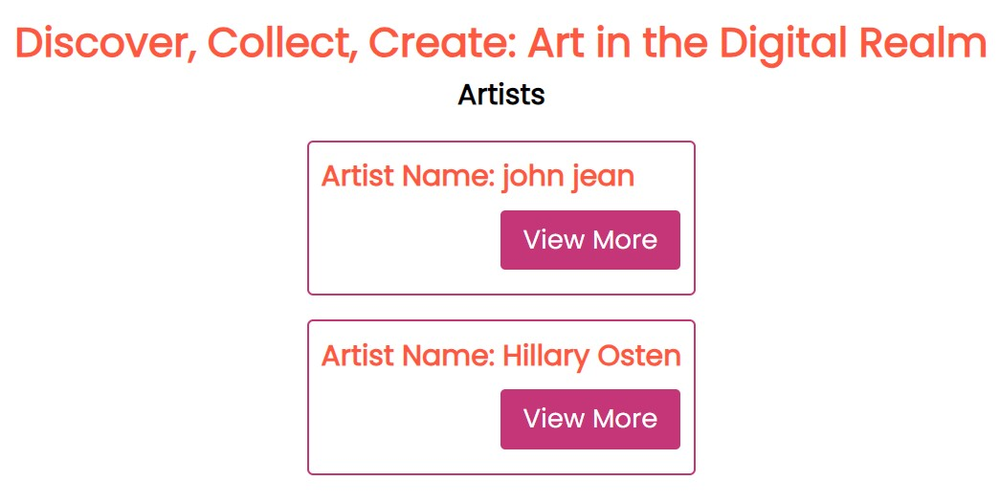 

## Technologies used
* HTML, CSS, JavaScript for frontend development.
* Python for server-side implementation.
* Flask the Web Development Framework.
* Additional libraries and frameworks may have been used. Details can be found in the code repository.

## Authors
* **Florence Njeri Kamau** - [@kamaufnjeri](https://github.com/kamaufnjeri)
* **Uel Kariuki** - [@uelkariuki](https://github.com/uelkariuki)
* **Abraham Bett** - [@Abraham](https://github.com/abraham-ship)

## Acknowledgment
* [ALX](https://www.alxafrica.com/) - software engineering.
* **Florence Njeri Kamau** - [@kamaufnjeri](https://github.com/kamaufnjeri) for the inspiration.
